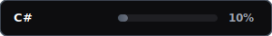

<p align="center">
  
</p>

# Hello, I'm Mario!

> "I can do whatever I propose (given the right amount of time)."

I am an Information Technologies and Software Development student focused on building responsive user interfaces, performant APIs, and testing new technologies. I love writing clean, containerized applications and structuring user interfaces.

---

### My Software Development Approach

- **Visual First:** I enjoy using mockups to plan and organize UI elements on the screen before writing the actual code.
- **Pragmatic Tech Decisions:** I understand that the choice of tech stack depends entirely on the project. For example, when choosing a database, it depends on whether the priority is read or write performance.
- **Sandbox Validation:** When I adopt a new technology, I explore and test it in isolated environments first. For instance, when I worked on an ESB-service with C#, I tested C# syntax and design patterns in mini-codes before using them in the main project.

---

### Technical Skills & Proficiency

#### Favorite Tech Stack (Active)

| Frontend                                               | Backend & Tools                                    |
| :----------------------------------------------------- | :------------------------------------------------- |
|      |  |
|  |  |
|    |  |
|    |  |

#### Familiar / Less Practiced Technologies

These are technologies I have explored or used in coursework and enterprise environments (such as ESB integrations) but do not practice on a daily basis:

| Technology | Proficiency Card                                   |
| :--------- | :------------------------------------------------- |
| **C#**     |  |
| **Java**   |    |

---

### About Me & Preferences

| Preferences                                 | Hobbies                             |
| :------------------------------------------ | :---------------------------------- |
| I prefer Linux over Windows for coding      | Watching anime & reading manga      |
| I prefer red berry tea over coffee          | Playing video games                 |
| I love Docker (used in specific situations) | Learning & testing new technologies |

---

### Links

<p align="center">
  <a href="https://www.linkedin.com/in/mario-alberto-lira-zamora-b891b5361">
    
  </a>
  <br>
  <a href="https://github.com/Mario09122004">
    
  </a>
  <br>
  <a href="https://github.com/MarioLiraGTech">
    
  </a>
</p>

<!--

**Want to update these scores or add new skills?**
Simply modify the dictionary at the top of [`generate_skills.py`](generate_skills.py) and run it via terminal:
```bash
python3 generate_skills.py
```

-->
